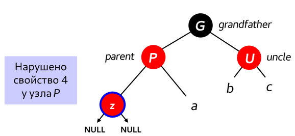
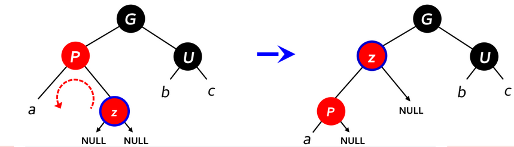
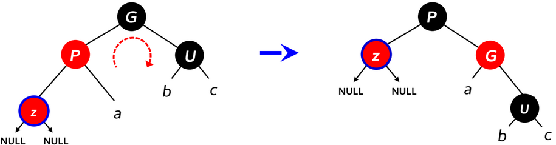
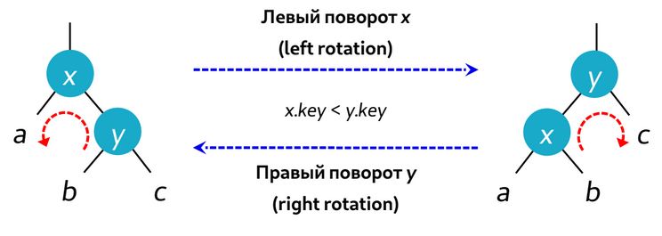

<h1>Красно-чёрное дерево</h1>

<b>Сбалансированное дерево поиска</b> - дерево поиска, у которого высота поддеревьев любого узла различается не более чем на заданную константу k.

Все операции - логарифмическое время.

<b>Красно-чёрное дерево</b> - cбалансированное дерево поиска, в котором соблюдаются красно-чёрные свойства:

    1 -  Каждый узел дерева может быть либо красным, либо чёрным
    2 -  Корень дерева является чёрным узлом
    3 -  Каждый лист дерева является чёрным узлом
    4 -  У красного узла оба дочерние узла - чёрные
    5 -  У любого узла все пути от него до листьев, являющихся его потомками, содержат одинаковое количество чёрных узлов

<b>Чёрная высота</b> - количество чёрных узлов на пути узла Х до листа.

Красно-чёрное дерево с n внутренними узлами имеет высоту, не превышающую 2log2(n+1).

<h2>Свойства 2 и 4 могут быть нарушены при добавлении нового узла.</h2>
<h2>Случай 1</h2>

<h2>Случай 2</h2>

<h2>Случай 3</h2>

<h2>Повороты дерева</h2>

