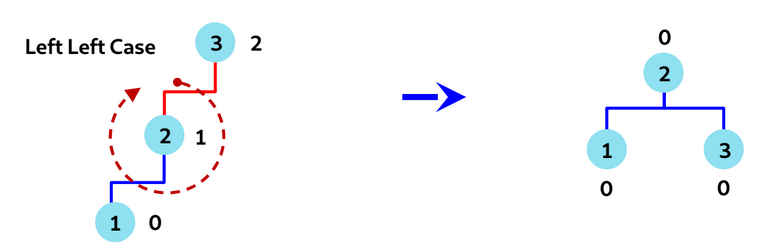
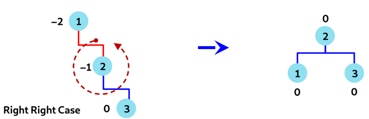
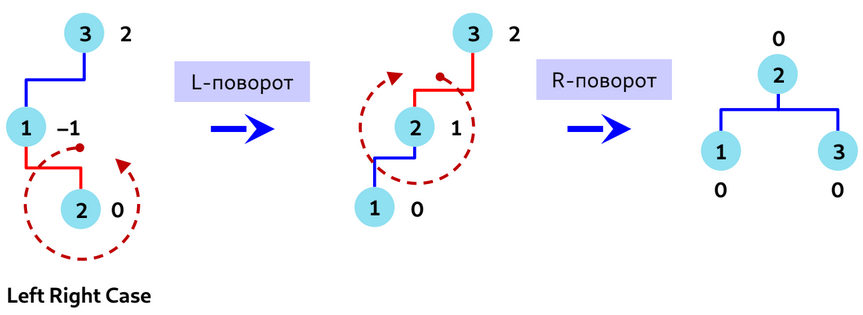
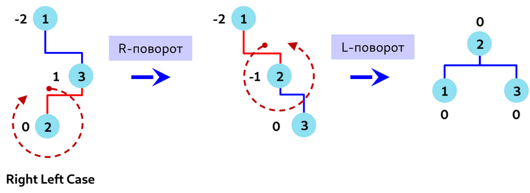

<h1>AVL-tree</h1><b>Сбалансированное дерево поиска (self-balancing binary search tree)</b> — дерево поиска,
в котором высота поддеревьев любого узла различается не более, чем на заданную константу k.

<b>АВЛ-дерево (AVL-tree)</b> - сбалансированное по высоте двоичное дерево поиска, в котором у любой вершины высота левого и правого поддеревьев различаются не более, чем на 1.

Все операции за логарифмическое время.

<b>Основная идея</b> - если вставка или удаление приводит к нарушению сбалансированности дерева, то необходимо выполнить его балансировку.

<b>Коэффициент сбалансированности узла</b> - разность высот его левого и правого поддеревьев. Может принимать значения {-1, 0, 1}.

<b>Высота узла</b> - длина наибольшего пути от него до дочернего узла, являющегося листом.

После добавления нового элемента необходимо обновить коэффициенты сбалансированности родительских узлов.

<h2>
Повороты:</h2>
<h3>
- Одиночный правый поворот (R-rotation, single right rotation)
</h3>

<h3>
- Одиночный левый поворот (L-rotation, single left rotation)
</h3>

<h3>
- Двойной лево-правый поворот (LR-rotation, double left-right rotation)
</h3>

<h3>
- Двойной право-левый поворот (RL-rotation, double right-left rotation)
</h3>

Алгоритм ленивого удаления:
1) С каждым узлом дерева ассоциирован флаг deleted
2) При удалении узла находим его в дереве и устанавливаем флаг deleted = 1
3) При вставке элемента с таким же ключом, как и у удалённого, ставим флаг deleted = 0
4) При достижении порогового значения узлов с флагом deleted = 1 - строим новое дерево