<h1>Splay tree</h1>
<b>Косое дерево</b> - дерево поиска, обеспечивающее быстрый доступ к часто используемым узлам.

<h3>Добавление элемента в дерево:</h3>

1) Находим лист для вставки и создаём его (BST)
2) Применяем процедуру splay, которая поднимает его в корень дерева
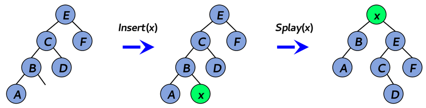

<h3>Удаление элемента из дерева:</h3>

1) Отыскиваем узел и удаляем его (BST)
2) Применяем к родителю узла процедуру splay

ИЛИ

1) Применяем процедуру splay и удаляем его - образуются 2 поддерева, L и R
2) Применяем процедуру splay к максимальному элементу из поддерева L

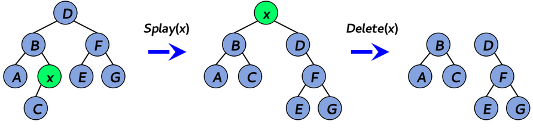

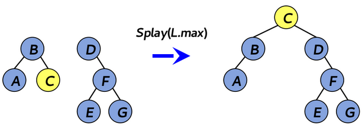

<h3>Поиск элемента в дереве:</h3>

1) Находим узел (BST)
2) При нахождении элемента выполняется splay для него

<h3>Процедура splay</h3>
Пусть p — родитель узла x, g — родитель p (дед узла x).

Splay перемещает узел в корень при помощи 3-х операций: zig, zig-zig, zig-zag

- zig

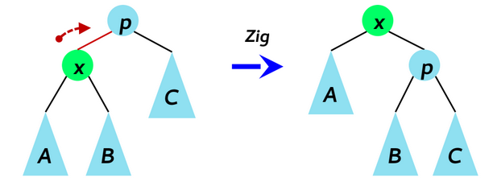

- zig-zig

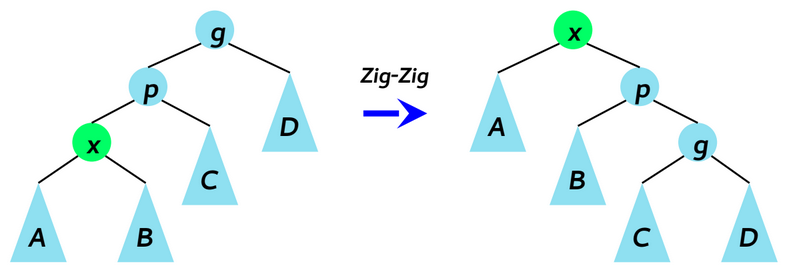

- zig-zag

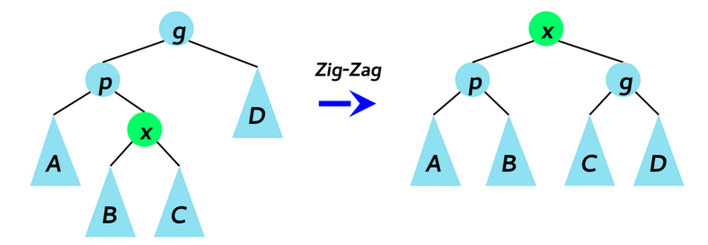

В худшем случае дерево имеет высоту O(n)

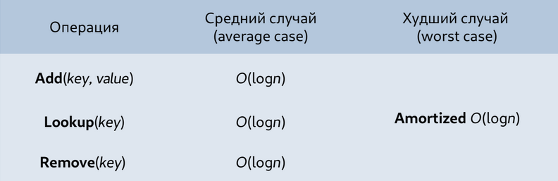

<h1>SKIP LISTS</h1>

<b>Список с пропусками</b> - структура данных для реализации словаря, основанная на нескольких отсортированных связных списках, пропускающих узлы.

<b>Основная идея</b> - реализация бинарного поиска для связных списков.

<h3>Списки с пропусками:</h3>

- Каждый элемент в списке с пропусками представлен узлом
- У каждого узла есть высота, которая соответствует количеству указателей на следующие уровни
- i-й указатель узла указывает на следующий узел, находящийся на уровне i или выше
- При вставке элемента в список, узел вставляется на уровень со случайным номером
- Уровни со случайными номерами генерируются по шаблону

<b>Skip list - связный список, в котором каждый узел содержит различное количество связей, причём i-е связи в узлах реализуют односвязные списки, пропускающие узлы, содержащие менее чем i связей.</b>

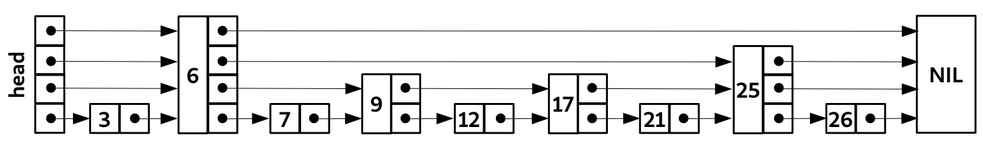

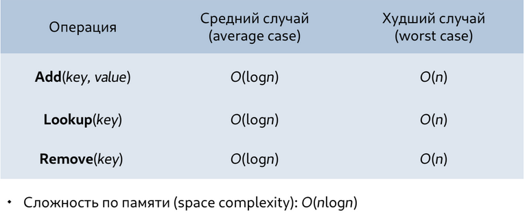

<h1>TRIE</h1>

<b>Префиксное дерево </b> - структура данных для реализации ассоциативного массива, ключами в котором являются строки.

<h3>Свойства</h3>

- Префиксное дерево содержит n строковых ключей и ассоциированные с ними значения
- Ключ - набор символов из алфавита
- Каждый узел содержит от 1 до d дочерних узлов
- За каждым ребром закреплён символ алфавита

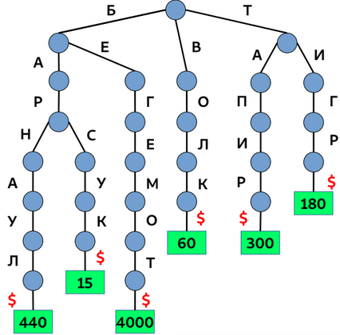

<h3>Вставка элемента в префиксное дерево</h3>

1) Инициализируем k = 1
2) В текущем узле отыскиваем символ c(i), равный key[k]
3) Если c(i) != NULL, то 
    - Делаем текущим узел, на который указывает c(i)
    - Переходим к следующему символу ключа (k += 1) и пункту 2
4) Если c(i) = NULL, создаём новый узел, делаем его текущим, переходим к следующему символу ключа и пункту 2
5) Если достигли конца строки, вставляем значение в текущий узел

<b>GetChild(node, c)</b> - возвращает указатель на дочерний узел, соответствующий символу c

<b>SetChild(node, c, child)</b> - устанавливает указатель, соответствующий символу c(i) в child

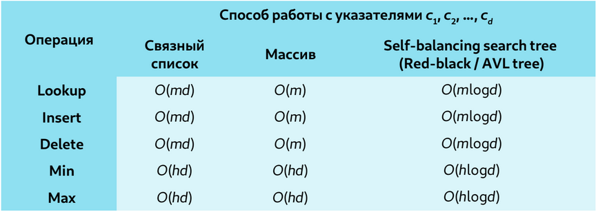

<h1>Bitwise tree</h1>

<b>Bitwise tree</b> - префиксное дерево, в котором ключи представлены как последовательность битов.

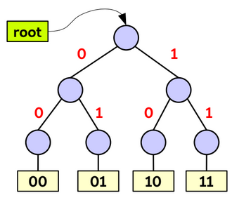

<h1>Radix tree</h1>

<b>Radix tree</b> - префиксное дерево, в котором узел, содержащий один дочерний элемент, обьединяется с ним для экономии памяти.

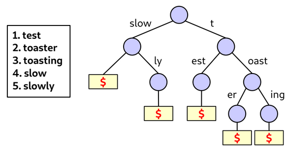

<h1>Suffix tree</h1>

<b>Suffix tree</b> - вариация префиксного дерева, содержащая все суффиксы заданного текста и их начальные позиции в тексте.
