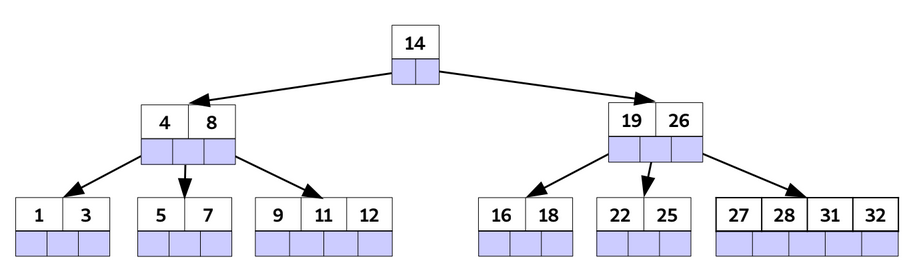
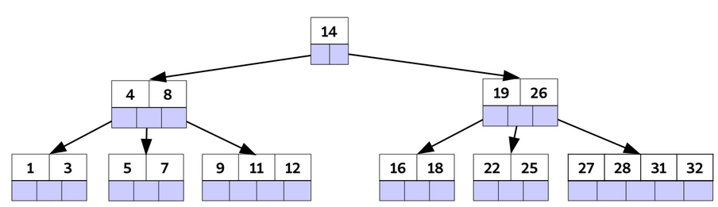
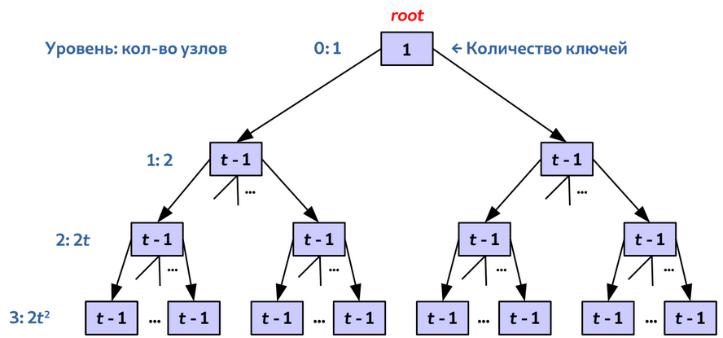
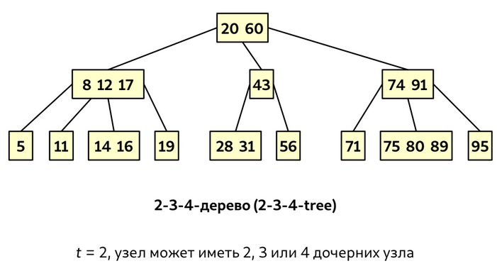
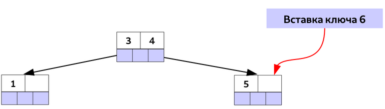

<h1>B-tree</h1>

<b>B-дерево</b> - сбалансированное дерево поиска, узлы которого хранятся во внешней памяти.

В любой момент в ОП находится лишь часть B-дерева.

<h3>В B-дереве:</h3>

- Высота не превышает O(log(n))
- Каждый узел может содержать более одного ключа
- Узел может иметь более 2-х дочерних вершин
- Если внутренний узел содержит k ключей, то у него k + 1 дочерних вершин

<h3>1) Каждый узел содержит:</h3>

- n - количество ключей, хранящихся в узле
- Ключи key1, key2, ... упорядочены по возрастанию
- Флаг leaf = true, если узел является листом
- Внутренний узел содержит n + 1 указателей на дочерние узлы

<h3>2) Ключи разделяют диапазоны ключей, хранящихся в поддеревьях.</h3>

<h3>3) Все листья расположены на одинаковой глубине, равной высоте h дерева.<h3>

<h3>4) Имеется нижняя и верхняя границы количества ключей, хранящихся в узле - минималная степень t B-дерева:</h3>

- Корневой узел содержит от 1 до 2t - 1 ключей
- Каждый внутренний узел содержит минимум t - 1 ключей и минимум t дочерних узлов
- Узел содержит максимум 2t - 1 ключей и максимум 2t дочерних узлов
- Узел заполнен, если содержит 2t - 1 ключей

<h3>Высота B-дерева с n>=1 ключами и минимальной степенью t>=2 в худшем случае не превышает logt((n+1)/2)</h3>

<h2>Операции с B-деревьями</h2>
Во всех операциях:

- Корень всегда в ОП
- Для чтения и записи используются DiskRead и DiskWrite
- B-дерево минимизирует количество операций DiskRead и DiskWrite - обращение к внешней памяти

<h3>Поиск элемента в B-дереве</h3>

1) Поиск начинаем в корня дерева. Для заданного ключа k ищем первый, k<=key(i). <b>Использовать бинарный поиск</b>
2) Если k = key(i), узел найден
3) Иначе, DiskRead на дочерний узел c(i) и рекурсивно обслудуем его ключи
4) Если достигли листа - ключ не найден

Вычислительная сложность: T = O(th) = O(tlog(t))

<h3>Поиск элемента в B-дереве</h3>

1) Для заданного ключа key находим лист для вставки нового элемента 
2) Если лист не заполнен (2t - 1 ключей или меньше), то вставляем ключ в узел

3) Если заполнен, то разбиваем на 2 листа по t - 1 ключей. Отыскиваем ключ-разделитель.
4) Ключ-медиана вставляется в родительский узел. Если он заполнен, разбирается всё по схеме.

Худший случай — разбиение узлов на каждом уровне: T = O(th) = O(tlogt(n))

<h1>B+-tree</h1>

<b>B+-tree</b> - вариация B-дерева, в котором информацию содержат только листья, а внутренние узлы хранят только ключи.

<h1>B*-tree</h1>

<b>B*-tree</b> - вариация B-дерева, в котором каждый узел должен содержать не менее 2/3 ключей.

<h1>External merge-sorting</h1>

<b>Внешняя сортировка</b> - класс алгоритмов сортировки, который оперируют данными, размещёнными во внешней памяти.

<h3>Как отсортировать 300 GiB данных, имея 2 GiB ОП?</h3>

<b>k-way merge sort</b> - k = 300 GiB / 2 GiB = 150 (150-way merge sort)

<h3>Алгоритм:</h3>

1) Загружаем блок размером 2 GiB в ОП
2) Сортируем блок и сохраняем во внешнюю память
3) Повторяем шаги 1 и 2, пока не получим 300 / 2 = 150 отсортированных блоков во внешней памяти
4) Создаём в оперативной памяти 151 буфер по 2 GiB / 151 = 13 MiB
5) Загружаем в 150 буферов по 13 MiB из отсортированных блоков, 151 - выходной блок
6) В выходной блок сливаем данные из 150 буферов и записываем его во внешнюю память
7) Повторяем шаги 5 и 6, пока не сольём все 150 блоков
