<h1>TREAP</h1>

<b>Декартово дерево</b> - структура данных для реализации словаря, объединяющая в себе бинарное дерево посика и бинарную кучу.

<h3>Каждый узел декартова дерева содержит:</h3>

- пару (x, y)
    - x - ключ бинарного дерева поиска
    - y - приоритет бинарной кучи
- указатель left на левое поддерево
- указатель right на правое поддерево

<h3>Все x и y различны.</h3>

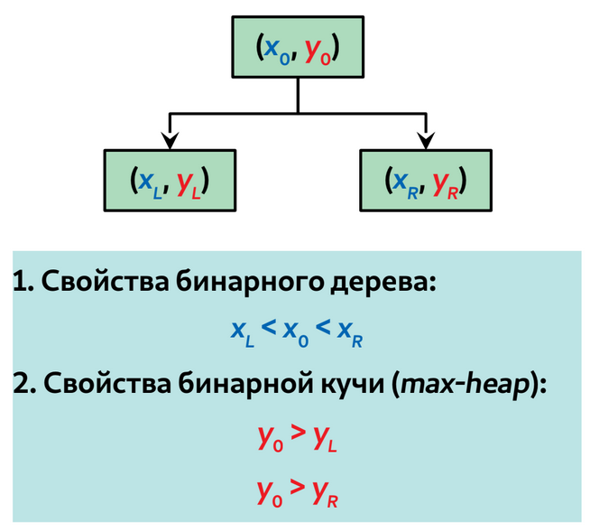

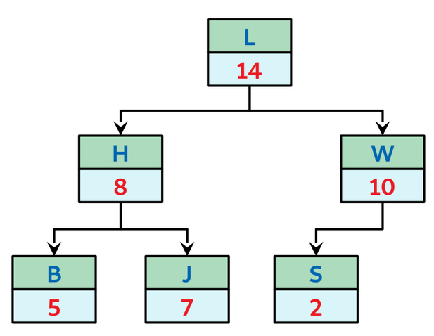

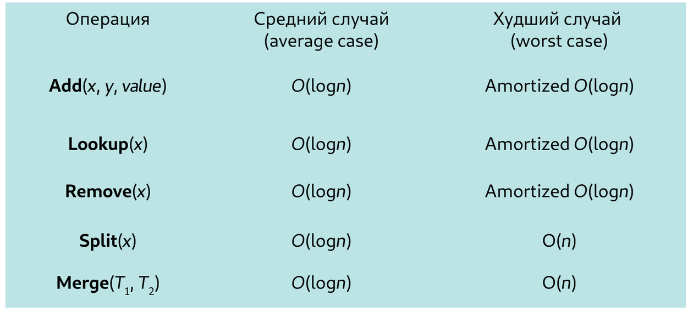

<h2>Операции бинарного дерева поиска</h2>

<h3><b>Поиск элемента</b></h3>

Как в BST.

<h3><b>Операция Split</b></h3>

Операция Split(T, x) разбивает декартово дерево на два дерева T1 и T2

- в дереве T1 находятся узлы с ключами node.x <= x
- в дереве T2 находятся узлы к ключами node.x > x

<b>Случай 1</b>: ключ разбиения больше ключа в корне, x > root.x

- левое поддерево T1 совпадает с левым поддеревом корня T
- для нахождения правого поддерева T1 необходимо разбить правое поддерева T по ключу x на T1(R) и T2(R) и взять T1(R)
- дерево T2 совпадает с деревом T2(R)

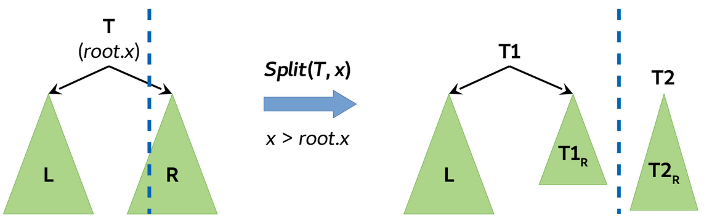

<b>Случай 2</b>: симметрично случаю 1

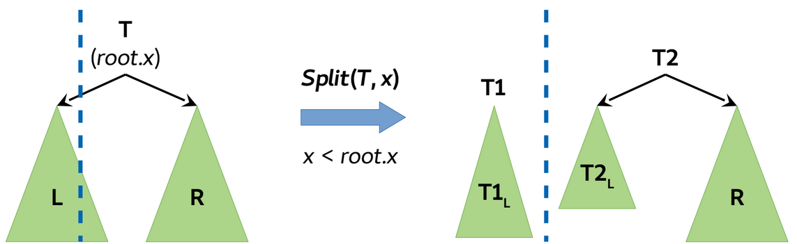

<h3><b>Операция Merge</b></h3>

Операция Merge(T1, T2) сливает два декартовых дерева T1 и T2 в новое дерево T (все ключи T2 должны быть больше ключей T1)

<b>Случай 1</b>: Приоритет корня T1 больше приоритета корня T2, T1.root.y > T2.root.y

- корень дерева T1 становится корнем T
- левое поддерево T1 становится левым поддеревом T
- правое поддерево T - обьединение правого поддерева T1 и дерева T2

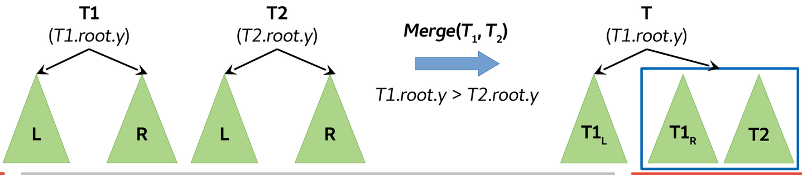

<b>Случай 2</b> симметрично случаю 1

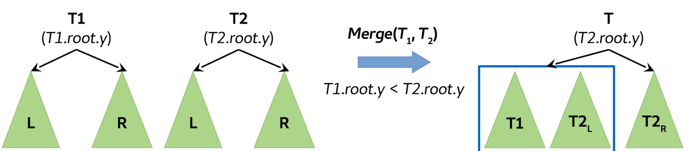

<h3><b>Операция Insert</b></h3>

Операция Insert(T, x, y, value) добавляет в декартово дерево узел node с ключом x, приоритетом y и значением value

- узел node - декартово дерево из одного элемента
- можно слить дерево T и дерево node, но по требованию операции Merge все ключи дерева node должны быть больше ключей T
- в дереве T некоторые ключи могут быть как больше x, так и меньше x

<b>Вариант 1</b>: преобразование деревьев для удовлетворения требований операции Merge:

- разобьем дерево T по ключу node.x на два поддерева T1 и T2, таким образом в дереве T1 будут узлы с x <= node.x, а в дереве T2 с ключами x > node.x
- сливаем дерево T1 и дерево node в дерево T1
- сливаем новое дерево T1 и дерево T2 с дерево T1

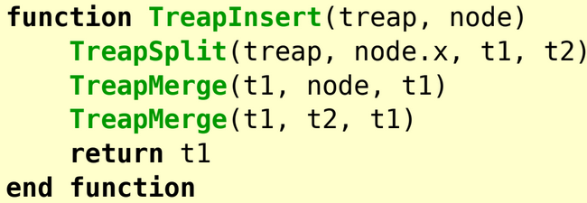

<b>Вариант 2</b>: без использования операции Merge:

- спускаемся по дереву поиска (по ключу node.x), останавливаемся, когда приоритет z.y < node.y
- дарбиваем дерево z по ключу node.x: в T1 узлы z с ключами <= node.x, в правое - > node.x
- делаем T1 и T2 девым и правым поддеревьями узла node
- дерево node ставим на место узла z

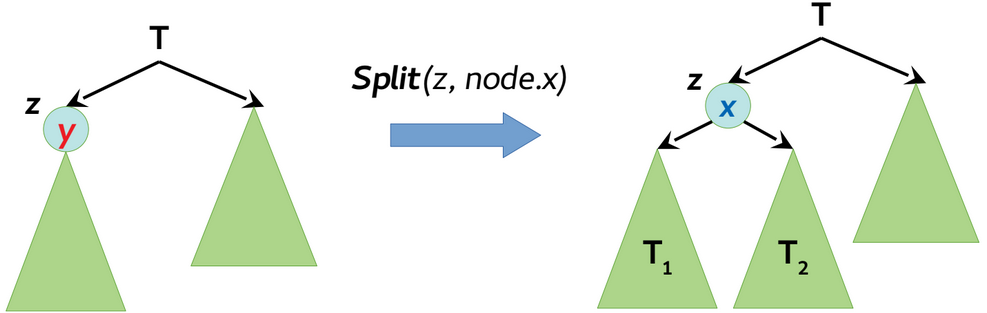

<h3><b>Операция Delete</b></h3>

Операция Delete - удаляет элемент из дерева

<b>Вариант 1</b>: с использованием операции разбиения (Split)

- находим в дереве T узел node с ключом x
- разбиваем дерево T по ключу x на деревья T1 и T2: Split(T, x)
- отделяем от дерева T1 узел с ключом x, для этого разбиваем T1 по ключу x - e на поддеревья T1 и T3(с ключом x): Split(T1, x - e)
- сливаем деревья T1 и T2: Merge(T1, T2)

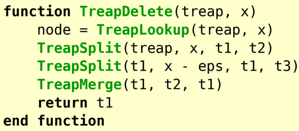

<b>Вариант 2</b>: без использования операции разбиения (Split)

- находим узел
- сливаем левое и правое поддерево найденнгого узла: Merge(node.left, node.right)
- результат слияния поддеревьев ставим на место узла node

<h2>Высота декартова дерева</h2>

В худшем случае высота дерева O(n)

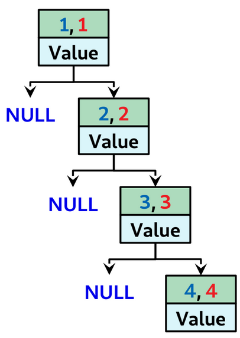

В декартовом дереве из n узлов, приоритет y которых является случайной величиной с равномерным распределением, средняя глубина вершины равна O(log(n))
